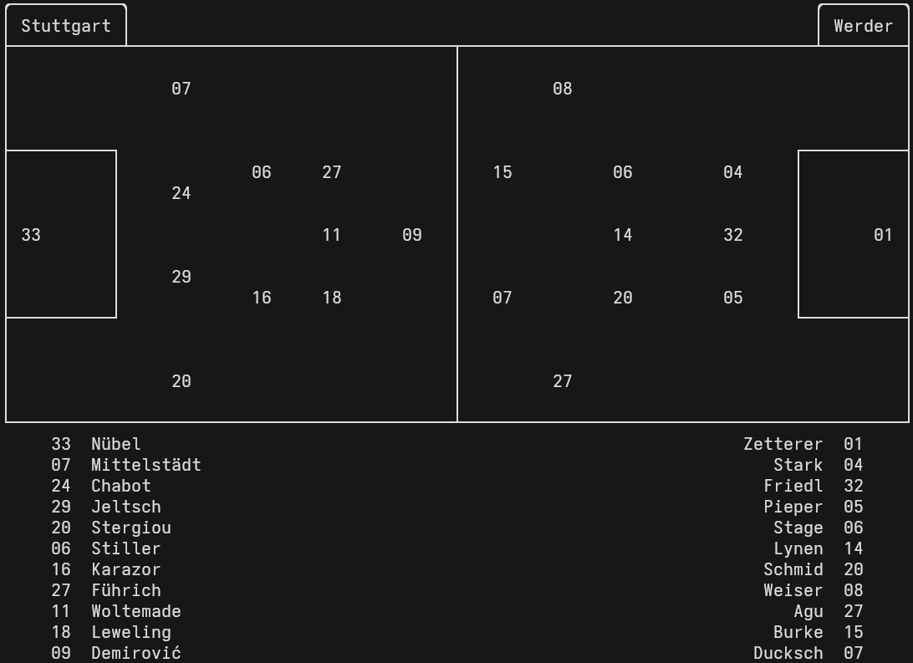
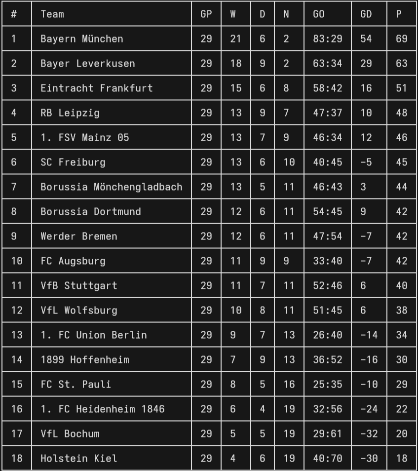
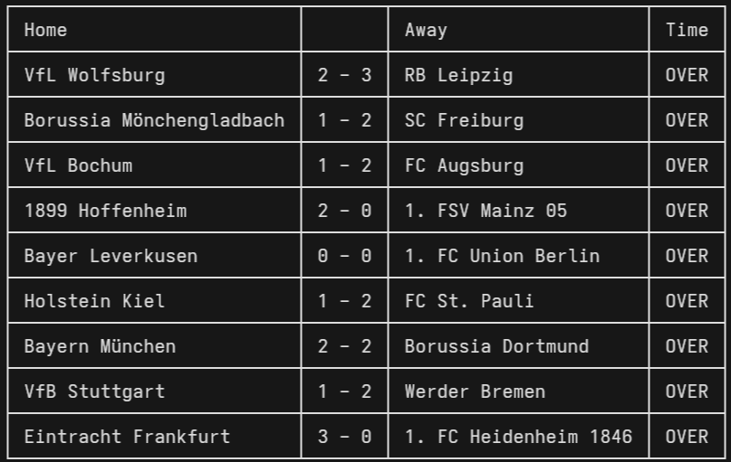

# Soccer
## TL;DR:
Soccer is a Rust-based terminal application that retrieves the scores, standings, and lineups for the current match day of the German Bundesliga and UEFA Champions League.

## Table of Contents
- [Features](#features)
- [Installation](#installation)
- [Usage](#usage)

## Features
### Display Lineups
<div align="center" style="text-align:center;">
  <picture>
    
  </picture>
</div>

### Display Standings
<div align="center" style="text-align:center;">
  <picture>
    
  </picture>
</div>

### Display Scores
<div align="center" style="text-align:center;">
  <picture>
    
  </picture>
</div>


## 🚀 Installation

### Prerequisites

- [Rust](https://www.rust-lang.org/tools/install)

To check if Rust is installed:

```bash
rustc --version
```

If not, install it using [rustup](https://rustup.rs/):

```bash
curl --proto '=https' --tlsv1.2 -sSf https://sh.rustup.rs | sh
```

---

### 🔧 Build and Install

Clone the repository:

``` bash
git clone https://github.com/yourusername/yourproject.git
cd yourproject
```

Then build and install the app:

```bash
cargo install --path .
```

This will compile the app and place the binary in your local Cargo bin directory (usually `~/.cargo/bin`).

You can now run the app from anywhere:

```bash
yourappname
```
---

### 💡 Updating

To update to the latest version, just pull the repo and reinstall:

```bash
git pull origin main
cargo install --path .
```


## Usage
-   **soccer**                                     » Displays the current scores
-   **soccer scores**                              » Displays the current scores
-   **soccer standings**                           » Displays the current standings 
-   **soccer match [team name (fuzzy search)]**    » Displays the lineup for the selected match
-   **soccer --help**                              » Displays the available Commands 
-   **soccer --version**                           » Displays the current version 
